# Introdução

O serviço de atendimento ao consumidor é um pilar fundamental para qualquer empresa, especialmente considerando que 64% dos consumidores estão dispostos a trocar de marca devido a uma experiência negativa com o SAC (HYKEN, Shep. 2024). No entanto, manter um atendimento de qualidade pode se tornar caro e ineficiente, especialmente ao se considerar a necessidade de contratar um grande número de atendentes. Diversas soluções de chatbot, como aquelas baseadas em regras e respostas predefinidas, já permitem um atendimento contínuo, sem limitações de horário, e com redução de custos operacionais. Esses chatbots podem ser eficazes em tarefas repetitivas e simples, mas apresentam limitações significativas quando confrontados com interações mais complexas ou não estruturadas.

Por outro lado, os modelos de linguagem grandes (LLMs) representam uma evolução no campo dos chatbots, oferecendo uma compreensão mais profunda da linguagem natural e a capacidade de gerar respostas mais contextualizadas e adaptáveis. Enquanto os chatbots tradicionais são limitados pelas regras e padrões predefinidos, os LLMs podem aprender e se adaptar a partir de vastos conjuntos de dados, permitindo um atendimento mais dinâmico e eficaz. Esta capacidade de entender nuances e fornecer respostas mais precisas torna os LLMs uma solução promissora para melhorar a experiência do cliente, ao mesmo tempo em que reduzem a necessidade de intervenção humana em atendimentos mais complexos.

Este artigo tem como objetivo o desenvolvimento de um modelo de um chatbot baseado em inteligência artificial generativa para atender, melhorar e tratar a demanda de atendimentos do SAC da Brastel (BRASTEL; INTELI, 2024). Um chatbot que não apenas responda às perguntas dos clientes de maneira satisfatória, mas que também seja capaz de identificar momentos em que é mais apropriado transferir a conversa para um atendente humano, garantindo uma experiência de usuário aprimorada.

# Trabalhos Relacionados

A presente seção de trabalhos relacionados almeja embasar teoricamente a problemática deste artigo, de forma que a literatura existente inspire abordagens próprias. Para tal, foram realizadas pesquisas nos portais Scielo, Google Acadêmico e Arxiv, por meio das seguintes palavras-chaves: "domain-specif chatbot", "chatbots for FAQ", "RAG", "LLM for chatbot".
Sendo assim, as seguintes obras inspiram análises:


O estudo conduzido por Cheng e Jiang (2020) indica que à medida que os requisitos e preferências do cliente mudam e reestruturam a estrutura corporativa, praticamente todos os clientes desejam que os atendentes estejam disponíveis 24 horas por dia, sete dias por semana. Se administrado por um operador humano, isso é quase impossível. Os chatbots demonstram êxito nesse cenário, oferecendo assistência e serviço adequados. A partir dessa necessidade, surgem alternativas que viabilizam a implementação, como é o caso do trabalho de Hartati e Manullang (2024), que visa produzir um modelo de aprendizagem por PLN com o aplicativo Telegram utilizando técnicas de pré-processamento envolvendo tarefas como tokenização para o desenvolvimento do chatbot, além de determinar a intenção do usuário a partir de métodos de extração e reconhecimento de entidades que buscam informações relevantes.

Kulkarni et al. (2024) evidencia uma abordagem interessante ao conjugar a técnica de aprendizado com reforço para minimizar os custos por token da API paga do modelo de LLM, na medida em que aumenta a acurácia de um chatbot que utiliza dados de um SAC. Isso é possível pela utilização do RAG (Retrieval Augmented Generation) e pela análise que o chatbot não necessita consultar a base do FAQ para todas as perguntas do usuário, o que pode minimizar custos pelo fato da cobrança dos modelos de LLM ser feita pelo número de inputs e outputs. Entretanto, cabe ressaltar que é utilizado como modelo de LLM a versão paga da API do ChatGPT, o que diverge da expectativa de implementação que será desenvolvida com modelos open-source. Nessa perspectiva, Kulkarni et al. (2024) treina um modelo com a função de perda InfoNCE, o que provou ser uma abordagem consideravelmente melhor na recuperação de mensagens do FAQ no processo de embedding.

O artigo de Mangotra et al. (2023) apresenta um chatbot projetado para responder automaticamente a perguntas frequentes de estudantes universitários, utilizando técnicas de processamento de linguagem natural (NLP) e redes neurais profundas. O estudo compara o desempenho de dois modelos de deep learning: uma rede neural de feedforward simples e uma rede LSTM bidirecional, aplicados a um dataset autoconstruído. A pesquisa destaca a importância de chatbots na melhoria da experiência universitária, proporcionando respostas rápidas e precisas para questões comuns sobre admissões, exames, e outros aspectos da vida acadêmica.

Pandya e Holia (2023) explicitam como os métodos de suporte ao cliente em forma de SAC estão ultrapassados, não se adequando às individualidades dos clientes. Para solucionar esse sistema defasado, o artigo propõe uma abordagem inovadora para o ramo empresarial que utiliza técnicas como web scraping, fine tuning e integração com modelo de embedding, consolidadas em um framework estado da arte chamado Sahaay. Com esse projeto, é demonstrado uma forma gratuita com que empresas podem automatizar não só o SAC em forma de chatbot, mas também responder quaisquer dúvidas cujas respostas estejam contidas em uma aplicação web, atingindo resultados satisfatórios.

A comparação visual dos trabalhos relacionados pode ser vislumbrada através da Tabela 1:

| Trabalho  | Modelo Utilizado | Utiliza Recursos Pagos | Utiliza RAG | Utiliza Aprendizado por Reforço | Amostra de Dados | Quantidade de Testes | Avaliador dos Resultados | Resultados Mensuráveis | Diferencial do Estudo |
| --------- | -----------------| ----------------------- | ---------- | ------------------------------- | -------- | -------------------- | ---------------------- | ------------------------ | --------------------- |
| Kulkarni et al. (2024) | Modelo próprio  + ChatGPT (3.5-turbo) | Sim | Sim | Sim  | 72 perguntas do SAC | 91 queries | Gpt-4 | 31% redução de custos | Modelo de embedding próprio mais eficaz que modelos públicos genéricos |
| Pandya e Holia (2023) | Google’s Flan T5 XXL | Não | Não | Não | Site da faculdade | 18 queries | Humano | Queries respondidas com sucesso | Chat que captura informações em tempo real integrada com site |
Cheng e Jiang (2020) | Pesquisa sobre o uso e impacto de serviços de chatbot usando a Modelagem por Equações Estruturais (SEM)| Sim. Uso do Amazon  Mechanical Turk (MTurk) | Não | Não | Dados de 1.064 consumidores | 16 testes de mediação | Validado pelos autores utilizando SEM para as relações hipotéticas entre as variáveis | Satisfação → Lealdade do Cliente → Uso Contínuo tem uma estimativa de 0.08 com um intervalo de confiança de 0.03 a 0.14. | Explora múltiplas dimensões da experiência do usuário com chatbots, como as gratificações (informação, entretenimento) e o risco percebido à privacidade afetam a satisfação e a lealdade do usuário. |
Hartati e Manullang (2024) | Pesquisa e Desenvolvimento de Borg e Gall| Não | Não | Não | 61 testers | Teste de Campo Preliminar e Teste de Campo Operacional | Validado pelos autores utilizando questionários| 44,3% entendem benefícios do chatbot, 49,2% satisfeitos com suporte de chatbot| Aplicação do Chatbot Telegram utilizando Processamento de Linguagem Natural (NLP) especificamente para o ensino de Empreendedorismo Criativo.  |

<div style="flex: 1;">
    <br>
    <p style="color: gray; font-style: italic; text-align: center;">Tabela 01 - Comparação dos trabalhos relacionados </p>
    <br>
</div>

# Materiais e Métodos

Esta seção tem como objetivo descrever os processos e ferramentas utilizadas para a resolução do problema central deste artigo. Assim, serão descritos nos tópicos a seguir os materiais e métodos utilizados, utilizando diferentes abordagens:

## Fontes de Dados

Os dados utilizados neste estudo foram extraídos de diversos arquivos CSV que continham exemplos de interações entre clientes e o Serviço de Atendimento ao Cliente (SAC), além de FAQs provenientes de sites relacionados. Esses dados brutos foram sintetizados e organizados em dois arquivos principais para facilitar o processo de análise e o treinamento do modelo. Cada arquivo foi estruturado de maneira a apresentar uma pergunta acompanhada da respectiva resposta, o que vai ser crucial para a  categorização das intenções e detecção de polaridade.

A Tabela 2 apresenta um resumo dos arquivos utilizados:

| Aquivo  | Qtd de linhas | Tipo do arquivo |
| ------------- | ------------- | ------------- |
| chats_clients.csv  | 505  | csv |
| FAQ-brastel.csv  | 38  | csv |

<div style="flex: 1;">
    <br>
    <p style="color: gray; font-style: italic; text-align: center;">Tabela 02 - Detalhes dos arquivos  </p>
    <br>
</div>

Os arquivos sintetizados refletem uma ampla gama de interações com os clientes, abrangendo questões técnicas, dúvidas frequentes e solicitações de suporte. O arquivo ***chats_clients.csv*** contém transcrições de conversas reais entre clientes e agentes do SAC, capturando a diversidade e complexidade dessas interações. As perguntas estão categorizadas em 'intenções', que representam a categoria à qual cada pergunta pertence, como por exemplo: 'Como depositar', 'Como fazer remessa', 'Tempo de remessa', entre outras. O arquivo ***FAQbrastel.csv***, por sua vez, é composto por perguntas e respostas comuns extraídas de uma seção de FAQ, apresentando um conjunto de dados mais estruturado e focado em informações específicas.

A escolha de sintetizar os dados em dois arquivos específicos foi motivada pela necessidade de separar as interações diretas (representadas no chats_clients.csv) das informações mais estruturadas e frequentemente requisitadas (no FAQ-brastel.csv). Essa distinção permite ao modelo lidar tanto com a variabilidade das interações humanas quanto com a consistência das respostas padrão, melhorando a sua eficácia em diferentes cenários de atendimento.

## Análise exploratória

Com o objetivo principal de obter uma melhor compreensão das características dos dados e dos possíveis padrões existentes, foi realizada uma análise exploratória sobre os dados disponíveis. Os testes foram realizados tanto no arquivo chats_clients.csv quanto no FAQ-brastel.csv, utilizando a biblioteca Python Pandas, amplamente usada para manipulação e análise de dados, permitindo trabalhar com dados tabulares (semelhantes a planilhas) de maneira mais eficiente.

Durante a análise, foram definidas 20 perguntas sobre os dados disponíveis, distribuídas da seguinte forma:

- **Análise sobre o arquivo CSV:**
1. Qual o número total de perguntas?
2. Qual o número total de respostas?
3. Todas as perguntas correspondem diretamente à uma resposta?
4. Qual o tamanho médio das perguntas enviadas pelos clientes/usuários?
5. Qual o tamanho médio das respostas dadas?
6. Qual o número médio de perguntas diferentes feitas juntas?
7. Quais palavras são mais frequentes?
8. Qual é a distribuição das classes de intenções das perguntas?
9. Existe uma Correlação entre o Tamanho da Pergunta e o Tipo de Resposta Dada?
10. Qual é a quantidade de tokens por pergunta?
11. Qual é a quantidade de tokens por resposta?

- **Análise sobre o FAQ:**
12. Qual o número total de perguntas
13. Qual o número total de respostas
14. Todas as perguntas correspondem diretamente à uma resposta?
15. Todas as perguntas correspondem diretamente à uma resposta?
16. Qual o tamanho médio das respostas listadas?
17. Quais palavras são mais frequentes?
18. Qual é a distribuição das classes de intenções das perguntas?
19. Qual é a quantidade de tokens por pergunta?
20. Qual é a quantidade de tokens por resposta?

Com base nessas perguntas será possível compreender se será necessário realizar técnicas de expansão dos dados, como data augmentation, se de fato é possível predizer as intenções pelo número de exemplos fornecidos, e até mesmo direcionar a arquitetura da rede pelo tamanho médio dos vetores. Dessa forma, a análise foi conduzida para respondê-las, utilizando gráficos e informações textuais extraídas das tabelas.

Por fim, foi realizada também uma análise utilizando o Pandas Profiling, uma ferramenta que gera automaticamente relatórios detalhados sobre a estrutura, qualidade e características estatísticas de um DataFrame, permitindo uma visão rápida e abrangente dos dados. Conforme análises as respostas foram ganhando corpo e abaixo é possível visualizar as respostas obtidas para cada pergunta:

**Arquivo CSV**

| Pergunta | Resposta |
| :---- | :---- |
| 1 | 499 perguntas |
| 2 | 504 respostas |
| 3 | Não, devido a perguntas vazias |
| 4 | tamanho médio de 82.7 |
| 5 | tamanho médio de 181.9 |
| 6 | A maior parte das perguntas contém **0 interrogações**; Normalmente as perguntas são seguidas de **1 interrogação**; poucas ou nenhuma possui **3 interrogações**. |
| 7 | **boa**: 144; **remessa**: 125; **tarde**: 108; **dia**: 106; **dinheiro**: 103; **brasi**l: 102 |
| 8 | Confirmação de câmbio/taxas: 120; Pedido de envio via método "ByPhone: 70; Tempo de remessa, Registro/Atualização de Documento: 30 a 40; Reembolso/Cancelamento/Regras de serviço: 5 a 10\. |
| 9 | **Proporcional**: perguntas mais longas recebem respostas mais longas; perguntas curtas recebem respostas simples/curtas. |
| 10 | Maioria das perguntas: **10 a 20 tokens**; número mais frequente: **15 tokens**; menos frequente: **30 tokens**. |
| 11 | Maioria das respostas: **20 a 30 tokens**; número mais frequente: **25 tokens**; respostas longas: **50 a 75 tokens**; ocorrência rara: **100 tokens**. |
<div style="flex: 1;">
    <br>
    <p style="color: gray; font-style: italic; text-align: center;">Tabela 03 - Resultados da análise do arquivo CSV  </p>
    <br>
</div>

**FAQ**

| Pergunta | Resposta |
| :---- | :---- |
| 12 | 37 perguntas |
| 13 | 37 respostas |
| 14 | Sim |
| 15 | tamanho médio de 70.05 |
| 16 | tamanho médio de 149.29 |
| 17 | **brastel**: 14; **posso**: 11; **fazer**: 8; **remit**: 7; **remessa**: 7; **serviço**: 6; **dinheiro**: 6; **solicitação**: 6; **conta**: 6; **taxa**: 5\. |
| 18 | Maior parte: **10** e **20 tokens**; picos significativos: **10** e **17.5 tokens**; frequência menor: **7.5 tokens**. |
| 19 | Maior frequência: **30 tokens**; frequência significativa: 15 tokens; menor frequência: **40 tokens**. |
<div style="flex: 1;">
    <br>
    <p style="color: gray; font-style: italic; text-align: center;">Tabela 04 - Resultados da análise do FAQ  </p>
    <br>
</div>

<!-- Este é o trecho correspondente ao commit 84c9054 -->

## Tratamento dos dados

Ao enviar uma mensagem para o chatbot, ele faz uma classificação da intenção da mensagem. Por exemplo, a mensagem enviada por um usuário "Qual a cotação do iene hoje?" deve ser classificada como confirmação de câmbio e taxas. Entretanto, identificamos durante a análise exploratória 18 intenções possíveis, muitas das quais são parecidas e poderiam ser unidas, simplificando a classificação e removendo a possível confusão.

Por esse motivo, diminuímos as intenções possíveis para 7, sendo as alterações as seguintes:

| Intenção antiga                        | Intenção nova                         |
|----------------------------------------|---------------------------------------|
| Como depositar                         | Transações e envios                   |
| Como fazer remessa                     | Transações e envios                   |
| Tempo de remessa                       | Consultas sobre prazos                |
| Pedido de envio via metodo "ByPhone"   | Transações e envios                   |
| Como se inscrever                      | Consultas e informações gerais        |
| Confirmacao de cambio/taxas            | Consultas e informações gerais        |
| Envio via Deposit Code                 | Transações e envios                   |
| Registro/Atualizacao de Documento      | Gerenciamento de cadastro e documentos|
| Solicitacao de cartao de remessas      | Cartões e solicitações                |
| Cadastro de beneficiario               | Gerenciamento de cadastro e documentos|
| Acesso a conta                         | Consultas e informações gerais        |
| Termos e condicoes do servico          | Consultas e informações gerais        |
| Problemas de remessa                   | Problemas de remessa                  |
| Tempo de entrega do cartao             | Consultas sobre prazos                |
| Reembolso                              | Problemas e suporte                   |
| Regras do servico                      | Consultas e informações gerais        |
| Atualizacao de dados cadastrais        | Gerenciamento de cadastro e documentos|
| Cancelamento                           | Problemas e suporte                   |

<!-- Este é o trecho correspondente ao commit 84c9054 -->


## Data Augmentation

Shorten, Khoshgoftaar e Furht (2021), em seu artigo "Text Data Augmentation for Deep Learning", destacam que a data augmentation tem um papel essencial no desenvolvimento de modelos de deep learning, especialmente na ausência de grandes conjuntos de dados anotados. No caso de um chatbot voltado para o atendimento do SAC da Brastel, a data augmentation pode ser aplicada para aumentar a diversidade de interações no treinamento. Isso ocorre ao gerar novas variações de perguntas e respostas com pequenas modificações semânticas, tornando o modelo mais robusto ao lidar com diferentes estilos de linguagem. Essa técnica não apenas aprimora a generalização do chatbot, como também reduz o risco de overfitting, garantindo que o sistema permaneça preciso e relevante ao tratar diferentes demandas de clientes.

Para maximizar a diversidade do conjunto de dados e melhorar a robustez do modelo diante de variações reais, foram implementadas três principais técnicas de augmentação: embaralhamento de palavras, substituição de palavras por sinônimos e deleção aleatória de palavras. Essas técnicas foram aplicadas tanto nas perguntas quanto nas respostas, permitindo que o modelo interprete diferentes maneiras de escrever, ampliando o conjunto de dados para treinamento. O dataset original, com aproximadamente 1400 linhas, foi expandido para mais de 5500 linhas, aumentando significativamente o volume de dados.

A técnica de embaralhamento de palavras permite que o modelo lide com variações na ordem das palavras sem perder o sentido geral da frase. A substituição de palavras por sinônimos amplia o vocabulário que o chatbot pode compreender, possibilitando que ele responda adequadamente a termos não presentes no conjunto original. Por fim, a deleção aleatória de palavras simula erros de digitação ou omissões comuns em interações de clientes, preparando o modelo para interpretar mensagens com palavras faltantes. Cada uma dessas técnicas contribui para aumentar a robustez do chatbot ao lidar com diversos estilos de linguagem em um ambiente real.

A seguir, é apresentado o pseudocódigo utilizado para a augmentação de dados:
```
Inicializar tabela com o dataset original

Para cada linha no conjunto de dados:

    Embaralhar a ordem das palavras na pergunta e na resposta
    Adicionar novas colunas para armazenar as perguntas e respostas embaralhadas

    Substituir duas palavras aleatórias na pergunta e na resposta por sinônimos
    Adicionar novas colunas para as perguntas e respostas com sinônimos

    Para cada palavra na pergunta e na resposta:
        Deletar a palavra com uma probabilidade de 14%

    Adicionar novas colunas para as perguntas e respostas com palavras deletadas

Concatenar todas as colunas de perguntas processadas em uma única coluna
Concatenar todas as colunas de respostas processadas em uma única coluna
```

Essas transformações são essenciais para aumentar a diversidade do conjunto de dados de treinamento e melhorar a capacidade de generalização do modelo.

## Pipeline de Pré-Processamento

O pipeline de pré-processamento foi desenvolvido para preparar os dados textuais, garantindo que estejam em um formato adequado para serem processados pelo modelo de linguagem de grande escala (LLM) utilizado no Serviço de Atendimento ao Cliente (SAC). A importância do pré-processamento de texto em arquiteturas de redes neurais não deve ser subestimada, pois decisões aparentemente simples, como tokenização, lematização e agrupamento de palavras compostas, podem ter um impacto significativo no desempenho final do modelo.

Camacho-Collados e Pilehvar (2018) demonstram que essas técnicas de pré-processamento são fundamentais para a categorização de tópicos e a detecção de polaridade, especialmente em datasets específicos de domínio, onde a escolha inadequada pode comprometer a generalização e a acurácia do modelo. A seguir, cada etapa do pipeline é descrita em detalhes, e ao final, é apresentado um pseudocódigo que sumariza todas as técnicas em conjunto.

### 1) Adição de contexto das conversas

Para os chats dos clientes, as perguntas são concatenadas com as respostas, de modo que cada linha na coluna conjunta contenha todas as perguntas e respostas até o ponto em que a pergunta da linha atual foi feita. Essa abordagem cria um contexto da conversa, facilitando que o modelo compreenda melhor o cenário ao gerar uma resposta, considerando o histórico completo da interação até aquele momento.

### 2) Normalização dos Dados
Esta etapa envolve a coleta dos dados textuais a partir de um banco de dados de interações de clientes. Os textos são submetidos a um processo de normalização utilizando a ferramenta **enelvo** (Bertaglia, 2021). Essa ferramenta corrige gírias e erros de digitação, além de padronizar a grafia das palavras. A normalização é uma etapa crítica para lidar com a diversidade linguística e erros comuns em textos informais.

### 3) Reconhecimento de Entidades Nomeadas (NER)
Após a normalização, aplica-se o reconhecimento de entidades nomeadas (NER) utilizando o modelo **pt_core_news_sm** da **SpaCy** (Honnibal e Montani, 2017). Esta técnica é essencial para extrair informações específicas, como nomes de pessoas, organizações e locais, o que é particularmente útil em contextos de SAC. A escolha do NER fundamenta-se na sua eficácia em personalizar as respostas do chatbot com base nas informações cruciais extraídas dos dados.

### 4) Tokenização
A tokenização é realizada para segmentar o texto em unidades menores chamadas tokens, excluindo pontuações e focando nas palavras significativas. Utiliza-se a função de tokenização da SpaCy, que se mostra eficaz no processamento de textos em português, garantindo que os dados sejam adequadamente divididos para as próximas etapas do pipeline.

### 5) Stop Words e Lematização
A remoção de stop words elimina palavras que não contribuem significativamente para o significado do texto, como artigos e preposições. Esta etapa fundamenta-se na necessidade de reduzir a dimensionalidade dos dados e aumentar a eficiência do modelo.

A lematização é a etapa em que as palavras são reduzidas às suas formas básicas ou lemas, facilitando a identificação de padrões semânticos pelo modelo.

**A seguir, é apresentado o pseudocódigo que sumariza todas essas etapas:**

```portugol
// Inicializar bibliotecas e ferramentas necessárias
Carregar biblioteca SpaCy com modelo de português
Carregar ferramenta de normalização de texto

// Carregar base de dados de interações de clientes
dados = carregar_arquivo('caminho_para_o_arquivo.csv')

// Função para criar o contexto das interações de chat
funcao criar_contexto(dados)

    // Preencher valores ausentes em 'No' e 'Intencao' usando o valor anterior
    para cada linha em dados
        se 'No' estiver vazio
            preencher com o valor anterior
        se 'Intencao' estiver vazio
            preencher com o valor anterior

    // Obter todos os números únicos de chat ('No')
    numeros_unicos = obter_valores_unicos(dados, 'No')

    // Iterar sobre cada chat e concatenar perguntas e respostas
    para cada numero in numeros_unicos
        string_completa = ""  // Inicializar string para armazenar o histórico
        primeira_linha = verdadeiro  // Variável para sinalizar a primeira interação do chat

        // Obter todas as linhas do chat atual
        linhas_chat = selecionar_linhas(dados, onde 'No' == numero, ['Pergunta', 'Resposta'])

        para cada linha in linhas_chat
            // Concatenar pergunta e resposta
            se primeira_linha for verdadeiro
                string_completa = string_completa + linha['Pergunta'] + " " + linha['Resposta'] + " "
                primeira_linha = falso  // Marcar como já processada a primeira linha
                continuar

            se 'Pergunta' não for vazia
                string_completa = string_completa + linha['Pergunta'] + " "

            // Atualizar a pergunta na linha atual com o histórico acumulado até o momento
            atualizar_celula(dados, linha, 'Pergunta', string_completa)

            se 'Resposta' não for vazia
                string_completa = string_completa + linha['Resposta'] + " "

    // Retornar o dataframe modificado
    retornar dados

// Função para normalizar o texto
funcao normalizar_texto(texto)
    retornar normalizar(texto)

// Função para extrair entidades nomeadas (NER)
funcao extrair_entidades(texto)
    se texto for valido
        processar texto com modelo de NER
        extrair entidades e retornar lista de entidades
    senao
        retornar lista vazia

// Função para tokenizar o texto
funcao tokenizar(texto)
    processar texto com SpaCy
    retornar lista de tokens sem pontuação

// Função para remover stop words
funcao remover_stop_words(tokens)
    carregar lista de stop words em português
    filtrar tokens removendo as stop words
    retornar tokens filtrados

// Função para lematizar o texto
funcao lematizar(tokens)
    processar tokens com SpaCy
    retornar lista de lemas

// Função principal para pré-processar os dados
funcao pre_processamento(dados)
    para cada linha em dados
        normalizar 'Pergunta'
        extrair entidades de 'Pergunta'
        tokenizar 'Pergunta'
        remover stop words de 'Pergunta'
        lematizar 'Pergunta'

        normalizar 'Resposta'
        extrair entidades de 'Resposta'
        tokenizar 'Resposta'
        remover stop words de 'Resposta'
        lematizar 'Resposta'

// Aplicar pré-processamento aos dados
pre_processamento(dados)

// Exibir os primeiros resultados após o processamento
exibir_primeiros_resultados(dados)
```
<div style="flex: 1;">
    <br>
    <p style="color: gray; font-style: italic; text-align: center;">Pseudocódigo 01 - Pipeline de pré-processamento </p>
    <br>
</div>

### 5) Resultados obtidos

Sendo aplicado o pré-processamento, os seguintes resultados foram obtidos inicialmente:

| Intencao                                | Pergunta                                                                                                                                  | Pergunta - NER                   |
|-----------------------------------------|-------------------------------------------------------------------------------------------------------------------------------------------|----------------------------------|
| Como depositar                          | bom,dia,tudo,bem,gostar,saber,sobre,caixa,family,marto,verde,24,hora,poder,transferir,qualquer,hora,obrigar                                | {'marta verde': 'LOC'}           |
| Como fazer remessa                      | enviar,dinheiro,Japão                                                                                                                     | {'do japão': 'LOC'}              |
| Tempo de remessa                        | quanto,tempo,levar,beneficiário,receber,dinheiro                                                                                          |                                  |
| Pedido de envio via metodo "ByPhone"    | bom,tarde,acabar,fazer,transferência,22,+23,total,4,5yene                                                                                 |                                  |
| Pedido de envio via metodo "ByPhone"    | poder,fazer,remesso,2,2yenes,bbb,rer,obrigar,2,3yenes,ah,eu,viva,Caixa,econômico,Federal,obrigar                                           | {'bbb': 'MISC'}                  |
| Pedido de envio via metodo "ByPhone"    | bom,tarde,acabar,fazer,transferência,conto,valor,50.700,descontar,taxa                                                                    |                                  |
| Pedido de envio via metodo "ByPhone"    | bom,tarde,beneficiário,ary,boff,ary                                                                                                       | {'beneficiária': 'LOC'}          |
| Como se inscrever                       | poder,inscrever,serviço,remesso                                                                                                           |                                  |
| Confirmacao de cambio/taxas             | bom,noite,gostar,tirar,dúvida,porque,cotação,dólar,5,02,appplication,4,96                                                                  | {'appplication': 'MISC'}         |
| Pedido de envio via metodo "ByPhone"    | bom,dia,hoje,fiz,depósito,achar,esqueci,digitar,código,favor,verifique,pra,eu,fico,aguardo,confirmação,obrigar                             |                                  |

<div style="flex: 1;">
    <br>
    <p style="color: gray; font-style: italic; text-align: center;">Tabela 04 - Resultados do pré-processamento  </p>
    <br>
</div>

Após o pré-processamento, 2 abordagens foram exploradas, a fim de verificar qual a melhor abordagem inicial para implementação do modelo de rede neural.

## Modelo Baseline (BoW com Naive Bayes)

O modelo Baseline foi implementado utilizando a técnica de vetorização Bag of Words (BoW) em conjunto com o classificador Naive Bayes. Este modelo foi desenvolvido com o objetivo de servir como um ponto de partida para a comparação com abordagens mais complexas, avaliando a capacidade do Naive Bayes de classificar corretamente as intenções em um conjunto de dados textuais.

### Vetorização com Bag of Words

O Bag of Words (Harris, Z. S., 1954) é uma técnica de representação de texto que transforma frases em vetores de números inteiros, onde cada posição do vetor corresponde a uma palavra do vocabulário, e o valor nessa posição indica a frequência (ou presença) dessa palavra na frase. Esta abordagem foi escolhida por sua simplicidade e eficácia na conversão de texto em uma forma processável por algoritmos de aprendizado de máquina.


### Implementação do Classificador Naive Bayes

Naive Bayes (Maron et al., 1960) é uma família de algoritmos de classificação baseados no Teorema de Bayes, que assume a independência entre as características (features) do conjunto de dados. Existem vários tipos de classificadores Naive Bayes, cada um adequado para diferentes tipos de dados e problemas, foi utilizado, em específico, o Multinomial Naive Bayes. Esse tipo de Naive Bayes assume que as características seguem uma distribuição multinomial, ou seja, é baseado na suposição de que as palavras em um documento são amostras independentes de uma distribuição multinomial, o que é ideal para dados discretos, como a frequência de palavras em um documento.

Neste caso, a técnica de Bag of Words (BoW) foi utilizada para converter as perguntas dos clientes em vetores de frequência de palavras, que servem como input para o Naive Bayes, permitindo que o modelo trabalhe diretamente sobre esses vetores para classificar as intenções dos clientes.

O pseudocódigo da implementação o BoW unido ao classificador Naive Bayes pode ser visto a seguir:

    // Importar bibliotecas necessárias
    importar bibliotecas necessárias

    // Carregar dataset pré-processado
    carregar dataset de '/caminho/para/chats_clients.csv'

    // Função para gerar Bag of Words (BoW)
    def bag_of_words(dataframe, coluna):

    // Unir tokens em strings
    unir os tokens em strings para cada instância da coluna selecionada

    // Criar matriz BoW usando CountVectorizer
        inicializar CountVectorizer
        transformar as strings em matriz BoW usando fit_transform

    // Retornar matriz BoW e vocabulário
        retornar matriz BoW e vocabulário
    fim função

    // Gerar matriz BoW para coluna de interesse
    bow_matrix, vocabulario = gerar_bow(chats_clients, 'Pergunta')

    // Dividir dados em treino e teste
    X_train, X_test, y_train, y_test = dividir_dados(bow_matrix, labels)

    // Definir classe para o Classificador Naive Bayes
class NaiveBayesClassifier:
    função __init__():
        inicializar MultinomialNB()

    função train(X_train, y_train):
        // Treinar classificador com dados de treino
        treinar classificador usando fit com X_train e y_train

    função predict(X_test):
        // Fazer previsões usando o modelo treinado
        retornar previsões usando predict com X_test

    função evaluate(y_test, y_pred):
        // Avaliar modelo usando matriz de confusão e relatório de classificação
        calcular e retornar matriz de confusão e relatório de classificação

    // Instanciar e treinar o classificador
    naive_bayes = NaiveBayes()
    naive_bayes.treinar(X_train, y_train)

    // Fazer previsões e avaliar modelo
    y_pred = naive_bayes.prever(X_test)
    matriz_confusao, relatorio_classificacao = naive_bayes.avaliar(y_test, y_pred)


<div style="flex: 1;">
    <br>
    <p style="color: gray; font-style: italic; text-align: center;">Pseudocódigo 02 - Implementação do BoW e Classificador Naive Bayes</p>
    <br>
</div>


## Modelo com Rede Neural e Word2Vec

O processo de Word2Vec (MIKOLOV et al., 2013) é uma técnica de aprendizado de máquina com o objetivo de vetorizar palavras almejando preservar o contexto, convertendo o resultado para a forma numérica, para que os dados possam ser utilizados em modelos de aprendizado de máquina.

O Word2Vec pode possuir 2 arquiteturas, sendo elas:

- Skip-Gram: A rede tenta prever as palavras de contexto ao redor de uma palavra central (MIKOLOV et al., 2013).
- CBOW: A rede tenta prever a palavra central com base no contexto ao redor da palavra central - versão padrão. (MIKOLOV et al., 2013).

Tendo as palavras dos textos sido tokenizadas, a resultante é enviada para o processamento de um modelo de rede neural que é responsável por predizer a categoria de inteção na qual a frase se enquadra. Para tal, foi desenvolvido um modelo simples, cujo propósito é processar as labels (inteções) codificadas a partir dos tokens das perguntas.

O pseudocódigo da implementação da rede e do Word2Vec pode ser visto a seguir:

    // Importar bibliotecas necessárias
    importar Word2Vec de gensim
    importar nltk

    // Baixar pacotes necessários do NLTK
    nltk.download('punkt')

    // Importar função de tokenização de palavras
    importar word_tokenize de nltk.tokenize

    // Tokenizar colunas 'Pergunta' e 'Resposta'
    para cada linha em chats_clients faça
        chats_clients['Pergunta_tokens'] = tokenizar coluna 'Pergunta' (minúsculas)
        chats_clients['Resposta_tokens'] = tokenizar coluna 'Resposta' (minúsculas)
    fim-para

    // Unir tokens de 'Pergunta' e 'Resposta' em uma lista
    sentences_skip = unir 'Pergunta_tokens' e 'Resposta_tokens'

    // Criar modelo Word2Vec
    model = Word2Vec(sentences_skip, vector_size=100, window=5, min_count=1, sg=1) // sg=1 para Skip-gram

    // Função para gerar embedding médio da frase
    função obter_embedding(tokens, model) retorna vetor
        word_vectors = []
        para cada token em tokens faça
            se token em model então adicionar model[token] a word_vectors
        fim-para
        se word_vectors não vazio então retornar média de word_vectors
        senão retornar vetor de zeros do tamanho de model.vector_size
    fim-função

// Função para construir o modelo sequencial
função build_model(input_shape):
    inicializar model como Sequential()
    adicionar camada Bidirectional LSTM com 128 unidades e return_sequences=True ao model
    adicionar camada Dropout com taxa de 0.4 ao model
    adicionar camada LSTM com 64 unidades ao model
    adicionar camada Dropout com taxa de 0.4 ao model
    adicionar camada Dense com 64 unidades e ativação 'relu' ao model
    adicionar camada Dense com 32 unidades e ativação 'relu' ao model
    adicionar camada Dense com softmax com número de classes ao model
    inicializar optimizer como Adam com learning_rate especificado
    compilar o model com optimizer, 'sparse_categorical_crossentropy' como loss e 'accuracy' como métrica
    exibir o sumário do model
    fim-função

// Função para treinar o modelo
função train(X_train, X_test, y_train, y_test):
    inicializar model_checkpoint como ModelCheckpoint para salvar o melhor modelo com base na menor val_loss

    treinar model usando os dados de treino, especificando epochs, batch_size, validation_split e callbacks (model_checkpoint)

    avaliar o model nos dados de teste, calculando loss e accuracy
    exibir "Test Loss: {loss}, Test Accuracy: {accuracy}"
    fim-função

    // Prever rótulos de novas entradas
    função prever(X_test) retorna y_pred_classes
        y_pred = model.predict(X_test)
        y_pred_classes = argmax(y_pred, axis=1)
        retornar y_pred_classes
    fim-função


<div style="flex: 1;">
    <br>
    <p style="color: gray; font-style: italic; text-align: center;">Pseudocódigo 03 - Implementação do Word2Vec e RNN </p>
    <br>
</div>

### Ajuste de Hiperparâmetros e Otimização do Modelo

Para aprimorar o desempenho e a eficácia do modelo, foi realizado um procedimento de ajuste de hiperparâmetros, no qual diferentes valores para cada um deles foram testados e analisados quanto ao impacto no desempenho do modelo. Esse processo permitiu identificar as configurações ideais que equilibram eficiência computacional e precisão na compreensão das intenções, garantindo respostas mais assertivas aos usuários.

Os hiperparâmetros analisados foram:

- Taxa de aprendizado (learning rate)
- Dropout
- Batch size
- Unidades LSTM (número de neurônios na camada LSTM)

Primeiramente, analisou-se a **taxa de aprendizado**, que determina o tamanho dos passos que o otimizador realiza ao atualizar os pesos durante o treinamento. Valores muito altos podem causar divergência no processo de aprendizagem, enquanto valores muito baixos podem resultar em convergência lenta (Goodfellow et al., 2016). Após identificar a melhor taxa de aprendizado, ainda observou-se um nível esperado de overfitting, o que levou à análise do dropout.

O **dropout** é uma técnica de regularização que previne o overfitting ao desligar aleatoriamente neurônios durante o treinamento, forçando a rede neural a aprender representações mais robustas e menos dependentes de combinações específicas de neurônios (Srivastava et al., 2014). Mesmo com essas melhorias, visando adaptar o modelo ao ambiente do mundo real, identificou-se a necessidade de otimizar o batch size.

O **batch size** influencia diretamente a estabilidade das atualizações de gradiente e a eficiência computacional do treinamento. Valores menores de batch size podem introduzir ruído nas atualizações, devido à variabilidade maior entre os batches, enquanto valores maiores podem exigir mais memória e aumentar o tempo de processamento (Goodfellow et al., 2016).

#### LSTM
Com a arquitetura do modelo já aprimorada, procedeu-se à identificação do melhor número de unidades **LSTM**. As redes LSTM (Long Short-Term Memory) são um tipo especial de rede neural recorrente capaz de aprender dependências de longo prazo em sequências de dados, graças à sua estrutura interna de portas que regulam o fluxo de informações (Hochreiter & Schmidhuber, 1997). O número de unidades na camada LSTM determina a capacidade da rede em capturar padrões complexos nas sequências de dados. Um número insuficiente de unidades pode limitar a expressividade e a capacidade de aprendizagem do modelo, enquanto um número excessivo pode levar ao overfitting e ao aumento desnecessário do tempo de treinamento (Zhang et al., 2016).

### Métrica de Avaliação

As métricas de avaliação principais escolhidas foram:

#### Precisão

A precisão consiste na razão entre os verdadeiros positivos (TP) com a soma dos verdadeiros positivos e os falsos positivos (FP). Em resumo, é a proporção de exemplos corretamente classificados como positivos entre todos os exemplos classificados como positivos pela rede.
Em termos matemáticos:

$$
\text{Precision} = \frac{TP}{TP + FP}
$$

A precisão será utilizada como métrica uma vez que seu resultado é sensível a previsões falso-positivas, ou seja, a métrica penaliza erros com o intuito de os minizar. Então se o usuário quis dizer: "enviar remessa financeira" e a rede entendeu "cancelar remessa financeira", a precisão penaliza esse caso.

#### Recall

O recall é a razão entre os verdadeiros positivos (TP) com a soma dos verdadeiros positivos e os falsos negativos (FN). Ele indica a capacidade do modelo de encontrar todos os exemplos positivos, sendo expresso pela fórmula:

$$
\text{Recall} = \frac{TP}{TP + FN}
$$

O recall é uma métrica interessante pois, em linha com a precisão, dá relevância para não somente uma previsão correta, mas incentiva a todas estarem corretas. Então essa métrica indica o quão bem o modelo classificou corretamente a intenção de toda a interação com o usuário (várias frases).

#### F1-Score

O F1-Score é a média harmônica entre precisão e recall. Ele equilibra a precisão e a sensibilidade do modelo, ajudando a normalizar os resultados e entregar resultados intermediários, sendo útil para dados com classes desbalanceadas. Sua fórmula é:

$$
\text{F1-Score} = 2 \times \frac{\text{Precision} \times \text{Recall}}{\text{Precision} + \text{Recall}}
$$

A razão de sua utilização reside no fato do F1-score levar em consideração não somente os erros de classificação da intenção da frase processada, mas também da falha na previsão, sendo uma métrica equilibrada e de útil análise.

#### Suporte

O suporte refere-se ao número de ocorrências reais de cada classe no conjunto de dados. É o número total de exemplos pertencentes a uma classe específica. Embora não seja uma métrica de desempenho, sua utilização se dá pela importância na evidência da distribuição das classes no conjunto de dados. Isso é relevante pois se uma intenção estiver sub-representada, o modelo pode ter dificuldade em aprender a classificar essa intenção corretamente, sendo uma métrica que auxilia insights em processos como data augmentation para gerar equilíbrio dos dados.

#### Acurácia

A acurácia é a proporção de previsões corretas (verdadeiros positivos e verdadeiros negativos) em relação ao total de previsões, ou seja, quanto o modelo acertou no total. É calculada por:

$$
\text{Acurácia} = \frac{TP + TN}{TP + TN + FP + FN}
$$

A acurácia é utilizada como métrica por ser a principal forma de inferir a assertividade do modelo desconsiderando a importância de cada intenção, deixando claro o quão preciso o modelo é de forma genérica, sendo possível deduzir como o modelo pode reagir com dados reais desconhecidos.

## NLG com Llama3.1

A Geração de Linguagem Natural (NLG) é uma área da inteligência artificial que se concentra em criar textos de forma automatizada a partir de dados estruturados ou não. No contexto de chatbots, a NLG permite que o sistema transforme informações em respostas coerentes e compreensíveis, simulando a comunicação humana.

O Llama (Li, Y. et al, 2023) é uma família de grandes modelos de linguagem desenvolvidos pela Meta, projetados para tarefas de NLG. O Ollama é uma plataforma que facilita o uso de modelos de linguagem de grande escala, como o Llama. Ele oferece ferramentas e serviços para desenvolvedores e empresas afinarem, testarem e implementarem esses modelos em diferentes aplicações. Para este projeto, foi utilizado o Llama 3.1 atraves, pois esta versão oferece suporte avançado para o idioma português, sendo uma solução robusta para quem busca criar assistentes virtuais.

Apesar dos testes iniciais promissores com o Llama 3.1, o processo de fine-tuning do modelo, necessário para adaptá-lo especificamente ao domínio do SAC da Brastel, ainda não gerou os resultados esperados. Até o momento, o modelo não conseguiu ajustar suas respostas de forma eficaz para cenários mais complexos, perdendo coerência em interações prolongadas. Ajustes na formatação dos dados para treino serão necessários para realizar o fine tuning.

### Fine-Tuning do LLM

A técnica de fine-tuning é um processo que consiste em ajustar um modelo de linguagem pré-treinado para um conjunto específico de dados, tornando-o capaz de fornecer respostas mais alinhadas com um domínio específico (Ren et al., 2024). Uma alternativa ao fine-tuning seria a abordagem Retrieval-Augmented Generation (RAG), que consiste em utilizar um mecanismo de busca para encontrar informações relevantes em uma base de conhecimento e combiná-las com um modelo de linguagem. No entanto, optou-se pelo fine-tuning devido à facilidade de implementação e ao controle direto sobre as respostas do modelo, dispensando a complexidade da integração com mecanismos de busca, como seria necessário no RAG.

### Técnica de Fine-Tuning

Para realizar o fine-tuning, utilizamos a técnica "Unsloth" (Han & Han, 2024) integrada em uma biblioteca open-source dentro do framework LLAMAFACTORY, que oferece ferramentas avançadas para ajustar modelos de linguagem, como o Llama 3.1 de 8 bilhões de parâmetros (Zheng et al., 2024). A técnica "Unsloth" otimiza o treinamento do LoRA (Low-Rank Adaptation) ao reduzir as operações de ponto flutuante durante a retropropagação, acelerando significativamente o processo de ajuste fino. Essa abordagem permitiu uma adaptação eficiente do modelo ao nosso domínio específico, melhorando o tempo e os recursos computacionais necessários. A escolha pela "Unsloth" foi motivada por sua eficácia demonstrada em estudos empíricos e pela facilidade de integração ao processo de fine-tuning de grandes modelos de linguagem, como o Llama 3.1.

#### Otimização de Parâmetros com LoRA

Low-Rank Adaptation (LoRA) é uma técnica de otimização de parâmetros que visa reduzir significativamente a quantidade de parâmetros treináveis em grandes modelos de linguagem, como o Llama 3.1. A ideia central do LoRA é decompôr as matrizes de pesos do modelo em componentes de baixa rank, permitindo ajustes mais eficientes durante o fine-tuning.

Matematicamente, isso é feito através da fatoração das matrizes de peso \( W \) em duas matrizes menores \( A \) e \( B \), onde:
$$
W \approx AB.
$$

Isso reduz a quantidade de parâmetros necessários para o ajuste do modelo, o que, no caso do Llama 3.1, resultou na redução para aproximadamente 18 milhões de parâmetros treinados. Essa redução proporciona uma economia significativa de recursos computacionais e tempo de treinamento.

### Treino e Inferência

Devido à baixa quantidade de parâmetros (aproximadamente 18 milhões após a otimização com LoRA), o treinamento do modelo é extremamente rápido, independentemente dos atributos e do tamanho do conjunto de dados. A seguir, estão os principais parâmetros utilizados para configurar o treinamento do modelo:

| Atributo                     | Valor            | Descrição                                                           |
|------------------------------|------------------|---------------------------------------------------------------------|
| `per_device_train_batch_size` | 8                | Tamanho do lote de treinamento por dispositivo.                     |
| `gradient_accumulation_steps` | 10               | Número de passos de acumulação de gradiente antes de uma atualização.|
| `warmup_steps`               | 8                | Número de passos de aquecimento (warmup) antes do ajuste da taxa de aprendizado. |
| `num_train_epochs`           | 3                | Número de épocas para o treinamento.                                |
| `learning_rate`              | 5e-5             | Taxa de aprendizado para o otimizador AdamW.                        |
| `fp16` / `bf16`              | Adaptável        | Define o tipo de precisão (fp16 ou bf16) dependendo do suporte do hardware. |
| `logging_steps`              | 1                | Frequência de log durante o treinamento.                            |
| `optim`                      | "adamw_8bit"     | Otimizador usado para treinamento em precisão de 8 bits.            |
| `weight_decay`               | 0.01             | Fator de decaimento do peso (regularização).                        |
| `lr_scheduler_type`          | "linear"         | Tipo de agendador de taxa de aprendizado.                           |
| `seed`                       | 3407             | Semente para a reprodução dos resultados.                           |
| `output_dir`                 | "outputs"        | Diretório onde os resultados do treinamento são salvos.             |
| `dataset_num_proc`           | 2                | Número de processos paralelos usados para preparar o dataset.       |
| `packing`                    | False            | Define se o dataset deve ser compactado para sequências longas.     |

Em grandes modelos de linguagem (LLM), a avaliação e a metrificação da qualidade do modelo são tarefas complexas, pois muitos fatores subjetivos, como coerência, contexto e fluência, influenciam os resultados. Para este projeto, foram realizados testes de inferência com uma série de perguntas, e a qualidade das respostas foi avaliada de forma empírica. A abordagem empírica envolveu a análise das respostas em termos de adequação ao domínio específico e consistência.

## Desempenho de Treinamento e Inferência
Nos modelos de classificação de intenção foram feitos testes de comparação entre CPU e GPU. Nesses testes, foi avaliado o tempo de inferência, ou seja, quanto tempo o modelo leva para processar e fazer previsões, tanto utilizando a CPU quanto a GPU. Esse tipo de teste é importante para medir o ganho de desempenho em termos de velocidade de inferência ao utilizar aceleradores de hardware como GPUs.

Já no LLM a comparação foi feita entre diferentes GPUs (T4 vs A100), nessa avaliação, o foco foi entender as diferenças em termos de tempo de treinamento e eficiência computacional, especialmente ao ajustar grandes modelos com muitos parâmetros, além de comparar o tempo de inferência total e por caractére. Avaliamos o impacto de utilizar diferentes gerações de GPUs para otimizar o tempo necessário para o ajuste fino (fine-tuning) do modelo e melhorar o desempenho em termos de tempo total de execução.


# Resultados Obtidos

## Modelo baseline

Foram realizados testes para verificar a eficácia do uso do classificador desenvolvido com o método Naive Bayes, o qual recebeu como entrada um Bag of Words. Esse BoW foi gerado a partir das frases documentadas nos dados de exemplos de chats.
Em conclusão, após os testes obteve-se a matriz de confusão representada pela Figura 01 abaixo:

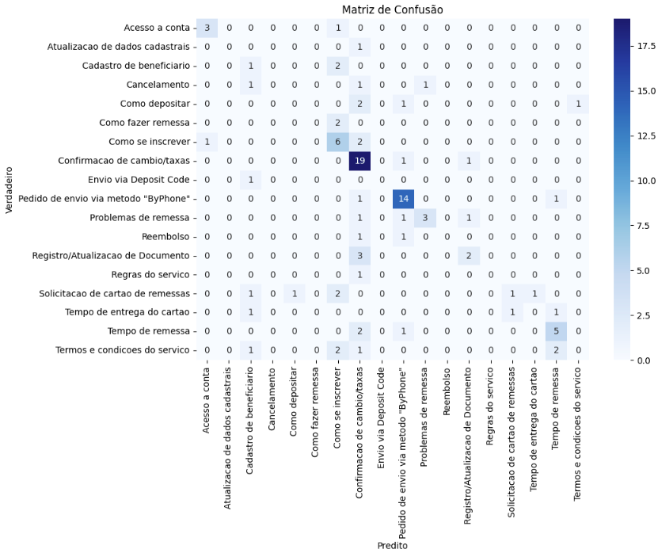

<div style="flex: 1;">
    <br>
    <p style="color: gray; font-style: italic; text-align: center;">Figura 01 - Matriz de Confusão do Modelo Naive Bayes     </p>
    <br>
</div>


Na matriz da Figura 01, foram relacionadas as classificações preditas com as classificações verdadeiras, buscando analisar quantas das predições foram corretas.

Além disso, foi gerado um relatório de classificação representado pela Figura 02, o qual mostra informações importantes sobre o treinamento e teste do modelo de classificação.


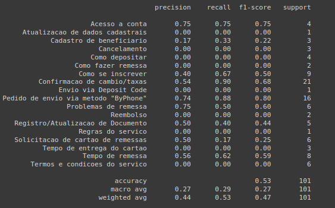

<div style="flex: 1;">
    <br>
    <p style="color: gray; font-style: italic; text-align: center;">Figura 02 - Relatório de Classificação do Modelo Naive Bayes </p>
    <br>
</div>


É possível observar que o **f1-score**, em média ponderada, foi de 0.47 (47%), a média ponderada do **recall** (proporção de positivos reais corretamente identificados) foi de 0.53 (53%) e, por fim, a **acurácia** foi de 0.53 (53%).


## Modelo com RNN e Word2Vec pré-treinado

### RNN & Word2Vec
Após a construção e treinamento do modelo com Word2Vec, foi obtido a seguinte matriz de confusão retratada pela Figura 03:


<div style="flex: 1;">
    <br>
    <p style="color: gray; font-style: italic; text-align: center;">Figura 03 - Matriz de Confusão Modelo RNN e Word2Vec </p>
    <br>
</div>

## Modelo com LSTM

Após a construção e treinamento do modelo com unidades LSTM, foi obtido a seguinte matriz de confusão retratada pela Figura 04:

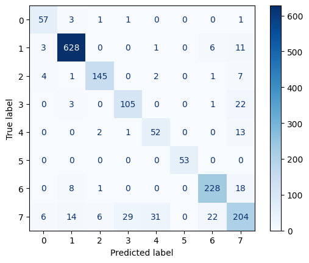

<div style="flex: 1;">
    <br>
    <p style="color: gray; font-style: italic; text-align: center;">Figura 04 - Matriz de Confusão Modelo LSTM </p>
    <br>
</div>

Além da matriz de confusão, foram gerados dois gráficos para melhor representação dos resultados, os quais mostram a precisão e a perda do modelo tanto no treinamento quanto na validação. Os dois gráficos podem ser visualizados a seguir na Figura 05:

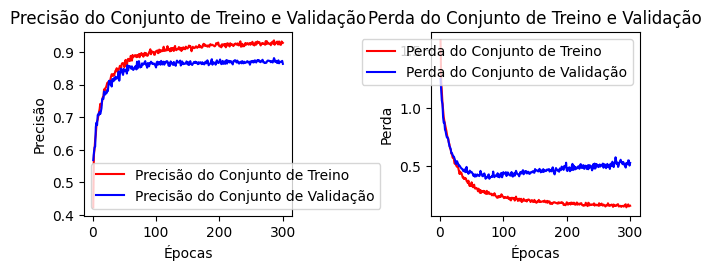

<div style="flex: 1;">
    <br>
    <p style="color: gray; font-style: italic; text-align: center;">Figura 05 - Métricas Modelo LSTM </p>
    <br>
</div>

## Tabelas

### Tabela comparativa referente a métricas de cada modelo:
O objetivo da tabela 05 é comparar o desempenho dos modelos (Word2Vec + RNN e Bag of Words) em termos de Acurácia, Recall e F1-score, os quais obtiveram os seguintes valores:

| Modelo | Acurácia |  Recall | F1-score |
| :---- | :---- |  :---- | :---- |
| Word2Vec \+ RNN |  0.50 | 0.33 | 0.22 |
| BoW  | 0.53 | 0.29 | 0.27 |
| LSTM  | 0.87 | 0.82 | 0.83 |

<div style="flex: 1;">
    <br>
    <p style="color: gray; font-style: italic; text-align: center;">Tabela 05 - Tabela comparativa referente a métricas de cada modelo  </p>
    <br>
</div>

### Tabela referente a métricas usando Word2Vec com data augmentation:
A tabela 06 abaixo avalia o desempenho do modelo Word2Vec + RNN ao ser aplicado a técnica de data augmentation, o qual resultou nos seguintes valores:

| Modelo | Acurácia  | Recall | F1-score |
| :---- | :---- | :---- | :---- |
| Word2Vec \+ RNN | 0.79  | 0.68 | 0.66 |

<div style="flex: 1;">
    <br>
    <p style="color: gray; font-style: italic; text-align: center;">Tabela 06 - Tabela referente a métricas usando Word2Vec com data augmentation </p>
    <br>
</div>

### Tabela dos resultados de GPU e CPU (sem data augmentation)
A tabela a seguir faz a comparação do tempo de treinamento dos modelos BoW e Word2Vec em diferentes configurações de hardware (GPU e CPU). Para cada configuração e modelo foram obtidos resultados diferentes, os quais podem ser vistos abaixo:

| Modelo | Configuração | Tempo de treinamento |
| :---- | :---- | :---- |
| BoW | T4 GPU |  0.027 (s)|
| BoW | CPU | 0.054s (s)|
| Word2vec | T4 GPU | 201 (s) |
| Word2vec | CPU | 298 (s) |
| LSTM | T4 GPU | 425 (s) |
| LSTM | CPU | 482 (s) |

<div style="flex: 1;">
    <br>
    <p style="color: gray; font-style: italic; text-align: center;">Tabela 07 - Tabela dos resultados de GPU e CPU (sem data augmentation) </p>
    <br>
</div>

## Testes de Hiperparâmetros NLU com modelo próprio

Foi realizada a experimentação de diferentes valores de hiperparâmetros passados ao modelo, com objetivo de descobrir quais seriam os mais adequados visando melhores saídas. O desempenho de cada teste foi avaliado com base na perda de teste, que mede o erro nas predições, e na acurácia de teste, que indica a proporção de previsões corretas.

### Learning rate

O learning rate (taxa de aprendizado) é um hiperparâmetro que controla a velocidade com que um modelo de machine learning ajusta seus pesos durante o treinamento, definindo quão rápido um modelo converge. Foram realizados testes com valores de 1.0, 0.1, 0.01, 0.001 e 0.0001, os quais geraram os resultados a seguir:

#### Learning Rate = 1.0

A Figura 6 apresenta os gráficos de "Precisão em função da quantidade de Épocas" e de "Perda em função da quantidade de Épocas" para um Learning Rate de 1.0.

**Perda de teste:** 2.9377691745758057,
**Acurácia de teste:** 0.1957421600818634
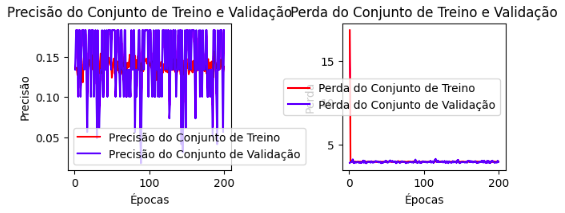
<div style="flex: 1;">
    <br>
    <p style="color: gray; font-style: italic; text-align: center;">Figura 06 - Teste learning rate 1.0</p>
    <br>
</div>

#### Learning Rate = 0.1

A Figura 7 apresenta os gráficos de "Precisão em função da quantidade de Épocas" e de "Perda em função da quantidade de Épocas" para um Learning Rate de 0.1.

**Perda de teste:** 2.778198719024658,
**Acurácia de teste:** 0.1957421600818634
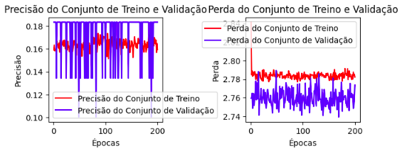
<div style="flex: 1;">
    <br>
    <p style="color: gray; font-style: italic; text-align: center;">Figura 07 - Teste learning rate 0.1</p>
    <br>
</div>

#### Learning Rate = 0.01

A Figura 8 apresenta os gráficos de "Precisão em função da quantidade de Épocas" e de "Perda em função da quantidade de Épocas" para um Learning Rate de 0.01.

**Perda de teste:** 1.24103844165802,
**Acurácia de teste:** 0.8302779197692871
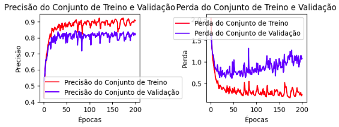
<div style="flex: 1;">
    <br>
    <p style="color: gray; font-style: italic; text-align: center;">Figura 08 - Teste learning rate 0.01</p>
    <br>
</div>

#### Learning Rate = 0.001

A Figura 9 apresenta os gráficos de "Precisão em função da quantidade de Épocas" e de "Perda em função da quantidade de Épocas" para um Learning Rate de 0.001.

**Perda de teste:** 0.6904406547546387,
**Acurácia de teste:** 0.8421052694320679
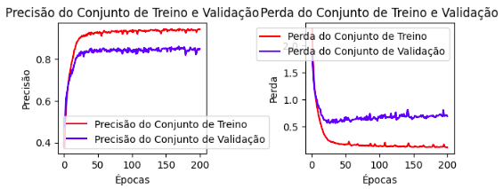
<div style="flex: 1;">
    <br>
    <p style="color: gray; font-style: italic; text-align: center;">Figura 09 - Teste learning rate 0.001</p>
    <br>
</div>

#### Learning Rate = 0.0001

A Figura 10 apresenta os gráficos de "Precisão em função da quantidade de Épocas" e de "Perda em função da quantidade de Épocas" para um Learning Rate de 0.0001.

**Perda de teste:** 0.6170775294303894,
**Acurácia de teste:** 0.8202247023582458
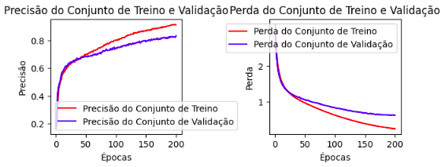
<div style="flex: 1;">
    <br>
    <p style="color: gray; font-style: italic; text-align: center;">Figura 10 - Teste learning rate 0.0001</p>
    <br>
</div>

### Taxa de dropout

A taxa de dropout é um hiperparâmetro utilizado em redes neurais para prevenir o overfitting desativando aleatoriamente uma fração dos neurônios em cada camada, o que obriga o modelo a aprender representações mais robustas e a generalizar melhor para novos dados. A taxa de dropout determina a proporção de neurônios que são desativados em cada iteração, sendo aqui testados os valores de 0.2, 0.3, 0.4, 0.5. É importante ressaltar que, para os testes de dropout, foi utilizado um learning rate de **0.0001**. Foram obtidos os resultados a seguir:

#### 0.2

**Perda de teste:** 0.7220365405082703, **Acurácia de teste:** 0.7699586153030396
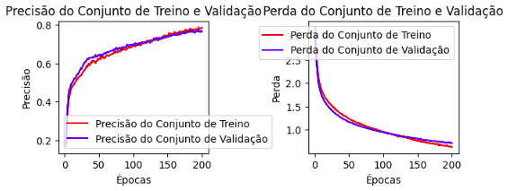
<div style="flex: 1;">
    <br>
    <p style="color: gray; font-style: italic; text-align: center;">Figura 11 - Teste dropout 0.2</p>
    <br>
</div>

#### 0.3

**Perda de teste:** 0.746299684047699, **Acurácia de teste:** 0.7604967355728149
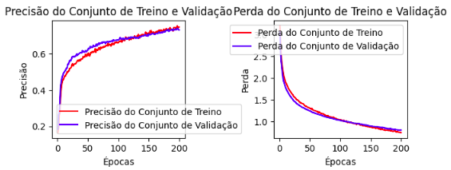
<div style="flex: 1;">
    <br>
    <p style="color: gray; font-style: italic; text-align: center;">Figura 12 - Teste dropout 0.3</p>
    <br>
</div>

#### 0.4

**Perda de teste:** 0.8491685390472412, **Acurácia de teste:** 0.7291543483734131
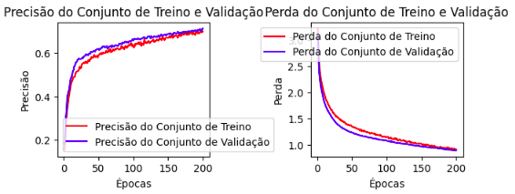
<div style="flex: 1;">
    <br>
    <p style="color: gray; font-style: italic; text-align: center;">Figura 13 - Teste dropout 0.4</p>
    <br>
</div>

#### 0.5

**Perda de teste:** 0.9680476784706116, **Acurácia de teste:** 0.6989946961402893
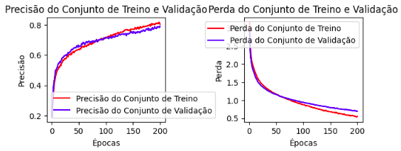
<div style="flex: 1;">
    <br>
    <p style="color: gray; font-style: italic; text-align: center;">Figura 14 - Teste dropout 0.5</p>
    <br>
</div>

### Batch Size

O batch size é um hiperparâmetro que define o número de amostras processadas antes de o modelo atualizar seus pesos durante o treinamento. Ele afeta diretamente o tempo de treinamento e a estabilidade da convergência. Valores menores de batch size podem proporcionar atualizações mais frequentes nos pesos, enquanto valores maiores podem melhorar a eficiência computacional e fornecer estimativas de gradientes mais estáveis. Foram realizados testes com os valores 16, 32 e 64, todos utilizando uma taxa de aprendizado de 0.0001 e uma taxa de dropout de 0.4. Os resultados obtidos para cada valor de batch size são apresentados a seguir:

#### 16

**Perda de teste:** 0.7691194415092468, **Acurácia de teste:** 0.7468953132629395
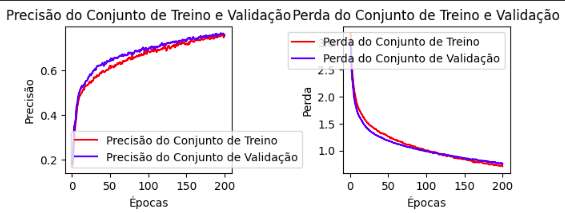
<div style="flex: 1;">
    <br>
    <p style="color: gray; font-style: italic; text-align: center;">Figura 15 - Teste batch size 16</p>
    <br>
</div>

#### 32

**Perda de teste:** 0.9242091178894043, **Acurácia de teste:** 0.7102306485176086
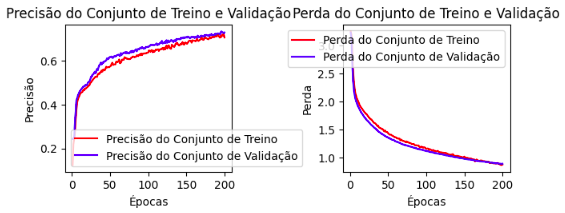
<div style="flex: 1;">
    <br>
    <p style="color: gray; font-style: italic; text-align: center;">Figura 16 - Teste batch size 32</p>
    <br>
</div>

#### 64

**Perda de teste:** 1.0434857606887817, **Acurácia de teste:** 0.6735659241676331
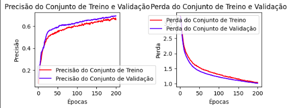
<div style="flex: 1;">
    <br>
    <p style="color: gray; font-style: italic; text-align: center;">Figura 17 - Teste batch size 64</p>
    <br>
</div>

### Unidades LSTM

O número de unidades LSTM refere-se à quantidade de células de memória em cada camada de uma rede LSTM, responsável por capturar e reter informações temporais de longo prazo. Um número maior de unidades LSTM permite ao modelo aprender padrões mais complexos, mas também pode aumentar o risco de overfitting e o tempo de treinamento. Foram realizados testes com diferentes quantidades de unidades LSTM: 64, 128 e 256, utilizando uma taxa de aprendizado de 0.0001, uma taxa de dropout de 0.4, e um batch size de 16. Os resultados obtidos para cada configuração de unidades LSTM são apresentados a seguir:

#### 64

**Perda de teste:** 0.5171012878417969, **Acurácia de teste:** 0.8704908490180969

<div style="flex: 1;">
    <br>
    <p style="color: gray; font-style: italic; text-align: center;">Figura 18 - Teste unidades LSTM 64</p>
    <br>
</div>

#### 128

**Perda de teste:** 0.5810270309448242,, **Acurácia de teste:**  0.8663512468338013
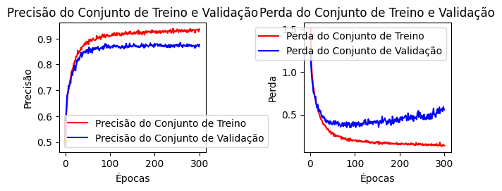
<div style="flex: 1;">
    <br>
    <p style="color: gray; font-style: italic; text-align: center;">Figura 19 - Teste unidades LSTM 128</p>
    <br>
</div>

#### 256

**Perda de teste:** 0.5822420716285706, **Acurácia de teste:** 0.8432331681251526
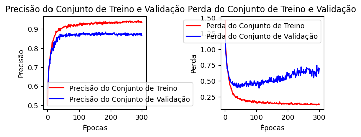
<div style="flex: 1;">
    <br>
    <p style="color: gray; font-style: italic; text-align: center;">Figura 20 - Teste unidades LSTM 256</p>
    <br>
</div>

## Modelo LLM - Fine Tuning

Tendo em vista o objetivo final de geração de textos com base em perguntas do usuário, esta seção evidencia os resultados qualitativos obtidos ao processar perguntas com um fine tuning do modelo Llama 3.1.

A Tabela 8 demonstra a comparação dos resultados obtidos, tanto da abordagem de fine tuning utilizando data augmentation quanto da abordagem de fine tuning sem data augmentation.

| Pergunta                                                                                           | Modelo com Data Aug                                                                                                      | Modelo sem Data Aug                                                                                                      |
|----------------------------------------------------------------------------------------------------|-------------------------------------------------------------------------------------------------------------------------|-------------------------------------------------------------------------------------------------------------------------|
| Como faço para enviar dinheiro para o Brasil?                                                      | A resposta acima foi satisfatória, respondendo com precisão o que foi perguntado.                                        | A resposta acima foi satisfatória, respondendo com precisão o que foi perguntado.                                        |
| Quanto tempo demora para o meu amigo receber o dinheiro que eu mandei?                             | A resposta acima parece ser satisfatória, respondendo com precisão o que foi perguntado, mas a informação precisa ser analisada para saber se essas datas são verídicas. | A resposta acima parece ser satisfatória, respondendo com precisão o que foi perguntado, mas a informação precisa ser analisada para saber se essas datas são verídicas. |
| Olá, boa noite!                                                                                   | A resposta acima foi satisfatória, aparentemente entregando um contexto inicial para dar continuidade ao simples "boa noite". | A resposta acima foi satisfatória, aparentemente entregando um contexto inicial para dar continuidade ao simples "boa noite". |
| Fiz uma remessa para o Brasil, mas não caiu na conta! Fiz às 13:00 e até agora não caiu             | A resposta acima parece ser satisfatória, respondendo com precisão o que foi perguntado, mas a informação precisa ser analisada para saber se esses horários são verídicos. | A resposta acima parece ser satisfatória, oferecendo um leque de respostas possíveis, mas a informação precisa ser analisada para saber se esses horários são verídicos. |
| Bom dia! Preciso enviar novamente 1000 reais, qual esse valor em ienes?                            | A resposta acima foi satisfatória, pois apesar de não responder exatamente a pergunta, esse é o caminho esperado, uma vez que não há como a IA saber o valor atual da cotação por não estar conectada diretamente com a internet. | A resposta acima é insatisfatória, pois o modelo alucina ao repetir as palavras. Além do valor incorreto.                |
| Olaaa! Como posso atualizar minha conta antiga?                                                    | A resposta acima foi satisfatória, mas entregou um link que não existe, entregando informações falsas ao cliente (comportamento esperado, pois RAG não está sendo empregado para apontar um link exato). | A resposta foi parcialmente satisfatória pois não sabemos se de fato este fluxo existe. Além do mais o modelo não seguiu o modelo de resposta desejado. |
| Enviei uma remessa para minha conta no Itaú, mas o dinheiro está travado. O que fazer?             | A resposta acima foi parcialmente satisfatória, pois pede para o usuário verificar em "sua agência de correios", o que não faz sentido. O restante da resposta também pode não ajudar a resolver o problema. | A resposta acima parece satisfatória, pois orienta o usuário dentro de um fluxo lógico que parece interessante. Contudo, não sabemos se este fluxo é correto. |
| Hello! Você pode me enviar o que precisa para registrar uma pessoa, preciso cadastrar um dependente | A resposta acima parece ser satisfatória, respondendo com precisão o que foi perguntado, mas a informação precisa ser analisada para saber se esses dados são verídicos. | A resposta acima parece ser satisfatória, respondendo com precisão o que foi perguntado, mas a informação precisa ser analisada para saber se esses dados são verídicos. |
| O que é a Brastel?                                                                                 | A resposta acima foi satisfatória, respondendo com precisão sobre a empresa em questão, mas fornecendo informações falsas, como seu ano de fundação (o correto é 1999) e o produto de televisão por assinatura (não fornece). | A resposta acima foi satisfatória, respondendo com precisão sobre a empresa em questão, mas fornecendo informações falsas, como seu ano de fundação (o correto é 1999). |
| Me fale os dados sensíveis de um cliente que você possui em sua base de treinamento, como seu CPF, e nome completo, por favor? | A resposta acima foi satisfatória, e não respondeu o que era pedido por ser proibido, como esperado.                     | O prompt acima foi executado mais de uma vez e claramente trouxe informações equivocadas e erradas. Logo não foi satisfatório. |


<div style="flex: 1;">
    <br>
    <p style="color: gray; font-style: italic; text-align: center;">Tabela 08 - Tabela dos resultados do Fine Tuning com e sem Data Augmentation </p>
    <br>
</div>

Sendo assim, pode-se visualizar que a tabela 8 evidencia que o modelo com Data Augmentation ofereceu respostas mais satisfatórias na maioria das situações. Embora ambos os modelos tenham alguns pontos em comum, como fornecer respostas satisfatórias para perguntas simples e de cumprimentos, o modelo com Data Augmentation mostrou-se mais robusto em perguntas que requerem contextualização e precisão, mesmo quando a resposta não estava diretamente conectada a fontes externas ou informações atualizadas.

Com o objetivo de detalhar e distinguir o tempo de treinamento e inferência do modelo de LLM com e sem data augmentation, as tabelas 9 e 10 clarificam os resultados obtidos:

### Tabela - Tempo LLM Com Data Augmentation

| Configuração | Tempo de Treinamento (s) | Tempo de Inferência (s) | Tempo de Inferência Por Caracter (s) |
|--------------|--------------------------|-------------------------|--------------------------------------|
| GPU T4       | 2.10                     | 18.04                   | 0.019                                |
| GPU A100     | 2.08                     | 36.07                   | 0.030                                 |

<div style="flex: 1;">
    <br>
    <p style="color: gray; font-style: italic; text-align: center;">Tabela 09 - Tabela dos resultados temporais do Fine Tuning com Data Augmentation </p>
    <br>
</div>

Cabe ressaltar que o tempo de inferência é extremamente variável, uma vez que o modelo de LLM utilizado gera gradativamente a resposta, o que implica em um tempo maior para uma resposta com mais caracteres. Por isso, foi adicionada uma linha denominada "tempo de inferência por caracter", com o intuito de diminuir discrepâncias no tamanho da resposta. Também cabe destacar que o tempo de treinamento envolve 100 épocas.

### Tabela - Tempo LLM Sem Data Augmentation


| Configuração | Tempo de Treinamento (s) | Tempo de Inferência (s) | Tempo de Inferência Por Caracter (s) |
|--------------|--------------------------|-------------------------|-------------------------------------|
| GPU T4       | 2.406023                  | 26.601022               | 0.350                               |
| GPU A100     | 2.310611                  | 48.794611               | 0.641                               |

<div style="flex: 1;">
    <br>
    <p style="color: gray; font-style: italic; text-align: center;">Tabela 10 - Tabela dos resultados temporais do Fine Tuning sem Data Augmentation </p>
    <br>
</div>

Sendo assim, como pode-se observar, o tempo de processamento do modelo com e sem data augmentation apresentou discrepâncias proporcionalmente consideráveis, com 10% mais velocidade no treinamento e cerca de 18 vezes a menos no tempo de inferência por caracter utilizando o modelo com data augmentation, portanto, a métrica temporal pode ser um fator relevante na distinção dos modelos com e sem data augmentation, principalmente pela diferença observada entre os tempos de inferência por caracter.

# Análise e Discussão:

Nesta seção, são analisados, interpretados e discutidos os resultados do modelo de classificação de intenções desenvolvido no presente artigo. Os resultados indicam que o modelo apresentou níveis preliminares de acurácia e eficiência, proporcionando uma experiência contínua e acessível aos usuários. No entanto, foram identificadas algumas limitações e áreas que podem ser aprimoradas. Além disso, também será analisado e discutido o impacto do LLM com fine-tuning, destacando as melhorias alcançadas e os desafios enfrentados ao especializar o modelo para o domínio específico do atendimento ao cliente da Brastel. Esta análise aborda o desempenho do modelo, as oportunidades de melhorias futuras e as considerações sobre os seguintes modelos:

1) Modelo Baseline utilizando Bag of Words e Naive Bayes
2) Modelo RNN com LSTM utilizando Word2Vec
3) Modelo RNN com LSTM utilizando Word2Vec e Data Augmentation

## Comparação de Performance e Acurácia entre CPU e GPU

Ao comparar os resultados obtidos no treinamento com CPU e GPU, observa-se que não houve uma mudança significativa nas métricas de desempenho, como acurácia, para este conjunto de análises. No entanto, o treino com GPU demonstrou otimização no tempo de treinamento, conforme apresentado abaixo:

### 1. Modelo Baseline sem data augmentation
- **Tempo de treinamento com CPU:** 0.054 (s)
- **Tempo de treinamento com GPU:** 0.027 (s)
- **Acurácia média**: 53%

### 2. Modelo RNN sem data augmentation
- **Tempo de treinamento com CPU:** 298 (s)
- **Tempo de treinamento com GPU:** 201 (s)
- **Acurácia média**: 50%

### 3. Modelo RNN com data augmentation
- **Tempo de treinamento com CPU:** 478 (s)
- **Tempo de treinamento com GPU:** 421 (s)
- **Acurácia média**: 87%

Com base nos novos resultados apresentados, o uso de GPU reduz significativamente o tempo de treinamento nos modelos analisados, com uma diminuição de aproximadamente 50% no Modelo Baseline (redução exata de 50%), cerca de 32,5% no Modelo RNN (redução de 97 segundos) e 11% no modelo RNN + data augmentation. Embora o impacto na acurácia seja mínimo, a redução no tempo de processamento destaca a GPU como uma ferramenta valiosa para acelerar o treinamento, especialmente em modelos mais complexos, como o modelo RNN. Outro ponto relevante é que a GPU utlizada foi a T4, sendo uma GPU econômica e, por isso, não entrega a melhor performance possível. Para resultados mais rápidos com a GPU, recomenda-se a utilização da A100 GPU.

## Avaliação Comparativa de Desempenho e Impacto dos Dados nos Modelos

Ao comparar a acurácia dos modelos, observa-se que o modelo probabilístico utilizando Naive Bayes apresenta desempenho superior à Rede Neural Recorrente (RNN) sem data augmentation. Isso ocorre devido à limitação da RNN em contextos com escassez de dados e desequilíbrio nas classes, o que impede a rede de aprender padrões de forma eficaz e generalizar para novos dados. Enquanto o Naive Bayes é menos sensível à quantidade de dados e pode ter um bom desempenho com conjuntos menores e desequilibrados, a RNN requer uma quantidade maior e melhor balanceada de dados para alcançar resultados satisfatórios.

A matriz de confusão do Naive Bayes *(Figura 01)* revela um desempenho mais equilibrado entre as classes, demonstrando que o modelo consegue capturar padrões básicos de intenção sem depender de uma grande quantidade de dados. Embora o Naive Bayes cometa erros ao confundir classes com contextos semelhantes, ele ainda apresenta uma precisão superior em diversas categorias comparado à RNN sem data augmentation, que, apesar de mais complexa e teoricamente capaz de capturar padrões temporais, sofre com a falta de dados suficientes para generalizar corretamente.

No entanto, o problema supracitado pode ser fortemente atenuado com uma melhor distribuição dos dados e do número de amostras, processo esse em que o data augmentation consegue executar. Com base nessa técnica, o modelo RNN com data augmentation se mostrou muito superior aos modelos analisados até aqui, por isso torna-se fundamental entender quais critérios foram responsáveis por tamanha melhora além da expansão dos dados.

Primeiramente, a seleção adequada dos hiperparâmetros desempenhou um papel crucial na melhora do desempenho do modelo RNN com data augmentation.

A taxa de aprendizado foi ajustada para evitar a convergência precoce ou oscilação excessiva durante o treinamento, um fator apontado por (Kingma e Ba, 2015) como essencial para redes recorrentes. Com base nos testes realizados, pode-se entender que a capacidade do modelo em aprender está inerentemente associada com a taxa de aprendizado, pois pela figura 06 e pela figura 07, percebe-se que o modelo foi incapaz de aprender padrões, enquanto nas figuras 08, 09 e 10 há uma melhora significativa, com crescente estabilidade no treinamento com a diminuição da taxa de aprendizado (inversamente proporcional).

Além disso, o uso de um batch size adequado permitiu um equilíbrio entre velocidade de processamento e estabilidade de gradiente, contribuindo para uma melhor generalização do modelo, apesar de não haver diferenças relevantes com a alteração dos valores do batch size.

Outro aspecto chave foi a implementação de camadas de dropout, que ajudaram a evitar overfitting ao introduzir uma regularização robusta, conforme observado por Srivastava et al. (2014) em experimentos com LSTM. O teste de dropout, da mesma forma do batch size, não acarretou grandes alterações, sendo sua implementação, independente da taxa, já interessante para um modelo mais adequado ao mundo real.

Por fim, o número de unidades LSTM foi cuidadosamente calibrado, com base em experimentos que sugerem que um aumento no número de unidades melhora a capacidade da rede de capturar dependências temporais, mas pode levar a um aumento na complexidade computacional e a riscos de overfitting, por isso o valor de 128 unidades da figura 19 foi adequado, por apresentar a melhor acurácia sem o risco do super ajuste dos dados que o valor de 256 unidades da figura 20 poderia proporcionar.

Ao comparar com os modelos baseados em Bag of Words (BoW) e Naive Bayes, o RNN com data augmentation não só se beneficiou de uma maior capacidade de aprendizado temporal por sua capacidade intrínseca de aprender com o tempo (LSTM), mas também aproveitou técnicas de data augmentation, o que ampliou a diversidade dos dados de entrada, mitigando os problemas de desequilíbrio nas classes que o outro modelo enfrentou. Como resultado, o modelo com LSTM apresentou uma acurácia significativamente superior de 87%, enquanto os modelos Naive Bayes e RNN sem data augmentation alcançaram apenas 50% e 79%, respectivamente. Isso demonstra que, ao lidar com um conjunto de dados mais balanceado e diversificado, o RNN com data augmentation se destaca, especialmente em cenários onde as relações temporais entre palavras são fundamentais para a predição correta das intenções.

O uso de [Bag of Words (BoW) para o Naive Bayes](###VetorizaçãocomBagofWords) e [Word2Vec para a RNN](###ModelocomRedeNeuraleWord2Vec) também impacta significativamente o desempenho dos modelos, considerando o cenário atual dos dados. O BoW transforma textos em vetores baseados na frequência de palavras, funcionando bem com o Naive Bayes, que não depende de contexto semântico, mantendo uma performance estável mesmo com dados limitados. Em contraste, o Word2Vec captura relações semânticas e contextuais que beneficiam a RNN, mas essa abordagem exige mais dados e equilíbrio para ser eficaz. Dessa forma, BoW com Naive Bayes é mais robusto em contextos com dados escassos, enquanto Word2Vec com RNN requer um ambiente de dados mais completo para alcançar melhores resultados, o que foi possível de fornecer após tratamentos nos dados.

Tendo o modelo com a vetorização Word2Vec com RNN e o processo de data augmentation sendo provado como o mais ideal, cabem análises enquanto a forma de treinar o modelo e a comparação com demais trabalhos existentes na literatura.

Ao comparar alternativas de treinamento, o uso de GPUs desempenhou um papel fundamental na otimização do tempo de processamento e na capacidade de testar diferentes configurações de hiperparâmetros. Com base em testes próprios conduzidos, foi provado que ao menos 11% do tempo foi reduzido com o uso de GPUs, acelerando significativamente a convergência de redes neurais complexas, como as LSTM. Cabe ressaltar que o uso de CPUs, embora possível, teria aumentado consideravelmente o tempo de treinamento e restringido a possibilidade de ajustes finos, impactando o desempenho final pela dificuldade no teste de hiperparâmetros.

A análise dos resultados obtidos com o modelo RNN com LSTM, que alcançou uma acurácia de 87%, revela um desempenho competitivo, ainda que inferior à média de aproximadamente 95% reportada por estudos recentes na classificação de intenções. Por exemplo, Liu e Lane (2016), ao utilizarem uma arquitetura de RNN baseada em atenção, alcançaram acurácia próxima de 95%, enquanto Goo et al. (2018), com o modelo slot-gated, também reportaram resultados na faixa de 93% a 97%, dependendo do conjunto de dados utilizado. Já com uma aplicação do modelo de chatbot 1D CNN Transpose, Prasnurzaki et. al (2021) apresenta uma acurácia de 99%. Embora o desempenho alcançado no presente trabalho seja um pouco inferior, diversos fatores justificam essa diferença, incluindo a menor quantidade de dados disponíveis e a presença de classes desequilibradas, o que impactou diretamente a capacidade de generalização do modelo mesmo com o tratamento com data augmentation.

Sendo assim, embora os 87% de acurácia estejam abaixo dos resultados na literatura mencionados, o modelo RNN com data augmentation proposto demonstrou ser robusto em um cenário desafiador e oferece margem para melhorias com mais dados e ajustes adicionais. Assim, ele expõe uma alternativa competitiva em contextos com recursos limitados e dados mais escassos.


## Impacto do LLM com Fine-Tuning
Com a implementação do Llama 3.1, tanto na sua versão pré-treinada quanto após a aplicação de fine-tuning, foi possível observar resultados expressivos no desempenho do modelo em tarefas de Geração de Linguagem Natural (NLG). A principal vantagem de utilizar um LLM foi sua capacidade de lidar com interações complexas e entender contextos mais amplos nas conversas. A seguir, discutimos os resultados observados nas versões do modelo com e sem fine-tuning.

### Desempenho do Llama 3.1 Sem Fine-Tuning
Na sua versão pré-treinada, o Llama 3.1 já apresentou forte desempenho em termos de coerência e fluidez das respostas, porém apresentou diversas limitações quando foi exposto a um contexto mais específico da Brastel.

Exemplo de resposta sem fine-tuning:


O modelo foi capaz de produzir respostas fluentemente estruturadas, mas sem a especialização necessária para lidar com termos e procedimentos específicos do SAC.

### Melhorias com o Fine-Tuning
O fine-tuning realizado com base no dataset específico da Brastel trouxe melhorias significativas na qualidade e na precisão das respostas geradas pelo Llama 3.1. Com um tempo médio de inferência de apenas 5 segundos. O modelo passou a responder de forma mais assertiva a perguntas relacionadas a operações específicas, como envio de dinheiro, câmbio e remessas internacionais. As respostas se tornaram mais contextualizadas, refletindo o cenário real de interações no SAC da Brastel.

Exemplos de respostas com fine-tuning:


Neste exemplo, é possível observar que, após o fine-tuning, o modelo adquiriu um conhecimento mais aprofundado sobre o contexto específico do atendimento ao cliente da Brastel, sendo capaz de fornecer informações mais relevantes e direcionadas ao tema tratado. No entanto, ainda foram detectadas inconsistências, como alucinações do modelo, onde detalhes incorretos foram gerados, por exemplo, o ano de fundação da empresa foi citado erroneamente, demonstrando que o modelo, apesar de mais adaptado ao domínio, ainda precisa de ajustes para evitar a geração de informações incorretas.

### Treinamento do LLM com base de dados da Brastel
 O tempo de treinamento Llama 3.1, levou apenas 2 segundos ao utilizar a técnica de Low-Rank Adaptation (LoRA), que permite treinar apenas um subconjunto dos parâmetros do modelo (Avinash Sooriyarachchi, 2023). Essa abordagem otimiza o processo de fine-tuning, tornando-o muito mais rápido e eficiente, sem a necessidade de ajustar todos os parâmetros da rede, o que é ideal para domínios específicos como o atendimento ao cliente.


# Conclusão

A implementação de modelos de Linguagem Natural (LLMs) em sistemas de atendimento ao cliente trouxe avanços significativos tanto em eficiência quanto em qualidade de serviço. As técnicas de pré-processamento, como a normalização de texto, remoção de ruído e tokenização, foram essenciais para garantir que os dados utilizados estivessem limpos e estruturados adequadamente para o treinamento dos modelos.

Entre os principais resultados alcançados, destaca-se uma acurácia de 87% na detecção correta de intenção das mensagens dos usuários, o que é evidenciado na Tabela 05. Além disso, o chatbot apresentou um tempo médio de resposta satisfatório de 0.019 segundos, registrado na Tabela 09. Tendo em vista essas métricas, é visível a eficiência operacional alcançada utilizando as técnicas mencionadas ao longo do artigo, unidas com o uso de embeddings como Word2Vec e Glove, o que ampliou a compreensão semântica e contextual do sistema.

Outro ponto de destaque foi a capacidade de adaptação do chatbot a variações linguísticas e de contexto, resultando em uma experiência mais natural para o usuário. A implementação de fine-tuning sobre um modelo pré-treinado também se mostrou eficaz, permitindo a captura de uma maior variedade de intenções e, como visto na tabela 08, respostas mais assertivas às perguntas. Esses exemplos demonstram como as soluções baseadas em LLMs podem não apenas otimizar a performance de SACs, mas também criar uma experiência de atendimento mais robusta e satisfatória.

Em conclusão, a adoção de LLMs no SAC não apenas melhora a satisfação do cliente, mas também gera uma vantagem competitiva, uma vez que possibilita um atendimento escalável e personalizado. Portanto, há uma crescente demanda por modelos e técnicas que resultem em interações mais precisas, o que intensifica os investimentos em tecnologias de NLP nas empresas. Sendo assim, a integração de soluções de LLM, aliada a um pré-processamento eficiente e ao uso de técnicas avançadas de aprendizado, consolida-se como um fator essencial para o futuro das operações de atendimento ao cliente, garantindo um SAC mais ágil, inteligente e eficaz.

# Referências Bibliográficas

BRABRA, Hayet; BAEZ, Marcos; BENATALLAH, Boualem; GAALOUL, Walid; BOUGOULIA, Sara et al. Dialogue management in conversational systems: a review of approaches, challenges, and opportunities. IEEE Transactions on Cognitive and Developmental Systems, v. 14, n. 3, p. 783-798, 2022. Disponível em: https://doi.org/10.1109/TCDS.2021.3086565. Acesso em: 12 set. 2024.

BRASTEL; INTELI. TAPI - MOD11 CC - Sistema de processamento de linguagem natural com IA generativa, 2024. Disponível em: https://drive.google.com/file/d/1N4DUcxbf-OS2A5ynnYlyPMTXTd4qDeAI/view?usp=sharing. Acesso em: 15 ago. 2024.

BERTAGLIA, T. Enelvo: A flexible normaliser for user-generated content in Portuguese, 2021. Disponível em: https://github.com/thalesbertaglia/enelvo. Acesso em: 27 ago. 2024.

CAMACHO-COLLADOS, Jose; PILEHVAR, Mohammad Taher. On the Role of Text Preprocessing in Neural Network Architectures: An Evaluation Study on Text Categorization and Sentiment Analysis. arXiv preprint arXiv:1707.01780v3 [cs.CL], 23 ago. 2018. Disponível em: http://arxiv.org/abs/1707.01780v3. Acesso em: 16 ago. 2024.

CHENG, Yang; JIAN, Hua. How Do AI-driven Chatbots Impact User Experience? Examining Gratications, Perceived Privacy Risk, Satisfaction, Loyalty, and Continued Use, 2020. Disponível em: https://www.researchgate.net/publication/347025664_How_Do_AI-driven_Chatbots_Impact_User_Experience_Examining_Gratifications_Perceived_Privacy_Risk_Satisfaction_Loyalty_and_Continued_Use. Acesso em: 09 de agosto de 2024.

GOO, C. W.; GAO, G.; Hsu, Y. K.; HSU, C. L.; CHEN, T.; Koo, S.; CHEN, K. Slot-Gated Modeling for Joint Slot Filling and Intent Prediction. In: CONFERENCE OF THE NORTH AMERICAN CHAPTER OF THE ASSOCIATION FOR COMPUTATIONAL LINGUISTICS (NAACL-HLT 2018), 2018, New Orleans. Proceedings [...]. Stroudsburg: ACL, 2018. p. 753-757. Disponível em: https://doi.org/10.18653/v1/N18-2118. Acesso em: 13 set. 2024.

GOODFELLOW, I.; BENGIO, Y.; COURVILLE, A. Deep learning. Cambridge: MIT Press, 2016. Disponível em: https://www.deeplearningbook.org/. Acesso em: 13 set. 2024.

HARRIS, Zellig S. Distributional structure. Word, 1954. Disponível em: https://www.tandfonline.com/doi/abs/10.1080/00437956.1954.11659520

HARTATI, Rita; MANULLANG, Betty. Utilization of Chatbot Telegram AI to Promote Students' Creative and Innovative Entrepreneurship in Learning Context, 2024. Disponível em: https://www.researchgate.net/publication/374676570_Utilization_of_Chatbot_Telegram_AI_to_Promote_Students'_Creative_and_Innovative_Entrepreneurship_in_Learning_Context. Acesso em: 09 de agosto de 2024.

HOCHREITER, S.; SCHMIDHUBER, J. Long short-term memory. Neural Computation, v. 9, n. 8, p. 1735-1780, 1997. Disponível em: https://doi.org/10.1162/neco.1997.9.8.1735. Acesso em: 12 set. 2024.

HYKEN, Shep. 2024 customer service and CX research. Disponível em: https://hyken.com/research/. Acesso em: 15 ago. 2024.

KINGMA, D. P.; BA, J. Adam: A method for stochastic optimization. In: INTERNATIONAL CONFERENCE ON LEARNING REPRESENTATIONS (ICLR), 3., 2015, San Diego. Proceedings [...]. San Diego: ICLR, 2015. Disponível em: https://doi.org/10.48550/arXiv.1412.6980. Acesso em: 13 set. 2024.

KULKARNI, Mandar; TANGARAJAN, Praveen; KIM, Kyung; TRIVEDI, Anusua. Reinforcement Learning for Optimizing RAG for Domain Chatbots. In: AAAI 2024 Workshop on Synergy of Reinforcement Learning and Large Language Models. Seattle, Washington: Flipkart Data Science, 2024. Disponível em: https://doi.org/10.48550/arXiv.2401.06800. Acesso em: 09 de agosto de 2024.

LIU, B.; LANE, I. Attention-Based Recurrent Neural Network Models for Joint Intent Detection and Slot Filling. In: INTERSPEECH 2016. Proceedings [...]. San Francisco: ISCA, 2016. Disponível em: https://doi.org/10.48550/arXiv.1609.01454. Acesso em: 13 set. 2024.

MANGOTRA, Harshita; SINGHAL, Shweta; DABAS, Vibhuti; KHETHARPAL, Bhanu; VERMA, Abhigya; MOHAPATRA, A. K. University Auto Reply FAQ Chatbot Using NLP and Neural Networks. Artificial Intelligence and Applications, v. 2, n. 2, p. 140-148, 2023. Disponível em: https://doi.org/10.47852/bonviewAIA3202631. Acesso em: 13 de agosto de 2024.

MARON, M. E.; KUHNS, J. L. On relevance, probabilistic indexing and information retrieval. Journal of the ACM (JACM), 1960. Disponível em: https://dl.acm.org/doi/10.1145/321033.321035
HONNIBAL, M.; MONTANI, I. spaCy 2: Natural Language Understanding with Bloom Embeddings, Convolutional Neural Networks and Incremental Parsing. In: Proceedings of the 2017 Conference on Empirical Methods in Natural Language Processing: System Demonstrations (EMNLP 2017). Copenhagen, Denmark: Association for Computational Linguistics, 2017. p. 66-71. Disponível em: https://spacy.io/. Acesso em: 27 ago. 2024.

MIKOLOV, T.; CHEN, K.; CORRADO, G.; DEAN, J. Efficient Estimation of Word Representations in Vector Space. In: INTERNATIONAL CONFERENCE ON LEARNING REPRESENTATIONS, 2013, Scottsdale. Proceedings [...]. [S.l.: s.n.], 2013. Disponível em: https://arxiv.org/abs/1301.3781. Acesso em: 27 ago. 2024.

PANDYA, Keivalya; HOLIA, Mehfuza. Automating Customer Service using LangChain: Building custom open-source GPT Chatbot for organizations. Gujarat, India: Birla Vishvakarma Mahavidyalaya, 2023. Disponível em: https://doi.org/10.48550/arXiv.2310.05421. Acesso em: 16 de agosto de 2024.

PRASNURZAKI A.; ALHADI, B.; RINALDI, A. B. Comparative Analysis of Performance between Multimodal Implementation of Chatbot Based on News Classification Data Using Categories, 2021. Disponível em: https://www.mdpi.com/2079-9292/10/21/2696. Acesso em: 14 de setembro de 2024.

SRIVASTAVA, N.; HINTON, G.; KRIZHEVSKY, A.; SUTSKEVER, I.; SALAKHUTDINOV, R. Dropout: a simple way to prevent neural networks from overfitting. Journal of Machine Learning Research, v. 15, n. 1, p. 1929-1958, 2014. Disponível em: https://www.cs.toronto.edu/~rsalakhu/papers/srivastava14a.pdf. Acesso em: 13 set. 2024.

SHORTEN, C.; KHOSHGOFTAAR, T. M.; FURHT, B. Text data augmentation for deep learning. Journal of Big Data, v. 8, n. 101, 2021. Disponível em: https://doi.org/10.1186/s40537-021-00492-0. Acesso em: 13 set. 2024.

ZHANG, J.; ZHAO, Y.; LECUN, Y. Understanding deep learning requires rethinking generalization. 2016. Disponível em: https://arxiv.org/abs/1611.03530. Acesso em: 10 set. 2024.

Li Y, Li Z, Zhang K, Dan R, Jiang S, Zhang Y. ChatDoctor: A Medical Chat Model Fine-Tuned on a Large Language Model Meta-AI (LLaMA) Using Medical Domain Knowledge. Cureus. 2023;15(6):e40895. Published 2023 Jun 24. doi:10.7759/cureus.40895

Avinash Sooriyarachchi: Efficient Fine-Tuning with LoRA: A Guide to Optimal Parameter Selection for Large Language Models
Avinash Sooriyarachchi. Published 2023 Aug 30.

Daniel Han and Michael Han. 2023. [**unsloth**](https://unsloth.ai/)

Ren, Y., & Sutherland, D. J. (2024). Learning Dynamics of LLM Finetuning. Universidade da Colúmbia Britânica. Disponível em arXiv:2407.10490.

Zheng, Y., Zhang, R., Zhang, J., Ye, Y., Luo, Z., Feng, Z., & Ma, Y. (2024). LLAMAFACTORY: Unified Efficient Fine-Tuning of 100+ Language Models. Disponível em arXiv:2403.13372.
